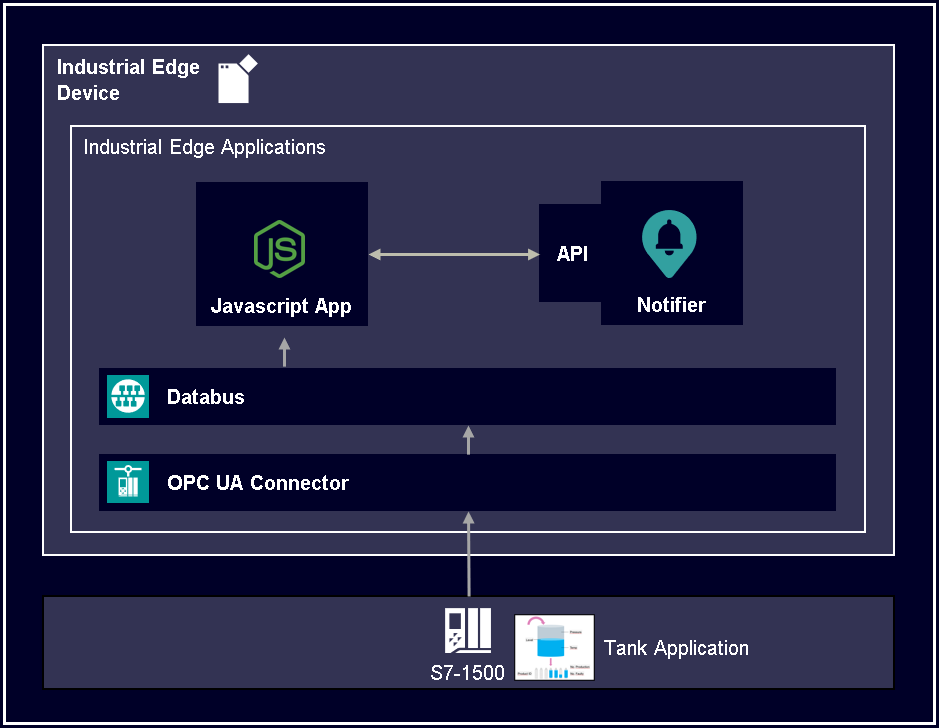

# Notifier OpenAPI implementation

This guide shows how to use the Notifier OpenAPI in different ways. Here the OpenAPI is implemented within an user-developed app to send notifications to the Notifier. Furthermore it is shown how to use the OpenAPI within the Flow Creator and with Postman.

- [Notifier OpenAPI implementation](#notifier-openapi-implementation)
  - [Description](#description)
    - [Notifier OpenAPI](#notifier-openapi)
    - [General task](#general-task)
  - [Requirements](#requirements)
    - [Used components](#used-components)
    - [Further requirements](#further-requirements)
    - [TIA Project](#tia-project)
  - [Implement Notifier OpenAPI within a custom app](#implement-notifier-openapi-within-a-custom-app)
  - [Using Notifier OpenAPI within the Flow Creator](#using-notifier-openapi-within-the-flow-creator)
  - [Using Notifier OpenAPI with Postman](#using-notifier-openapi-with-postman)
  - [Documentation](#documentation)
  - [Contribution](#contribution)
  - [License and Legal Information](#license-and-legal-information)
  - [Disclaimer](#disclaimer)

## Description

### Notifier OpenAPI

The Notifier OpenAPI definition contains the following HTTP requests:

Supported since Notifier V1.3:

Supported since Notifier V1.2 (deprecated):

The current Notifier OpenAPI specification can be downloaded [here](docs/Notifier%20OpenAPI.zip).

Using these HTTP requests, notifications can be for example triggered from another app and displayed in the Notifier.

### General task

This how to shows two ways of using the Notifier OpenAPI.

First it is described how to implement a JavaScript app in Docker including the Notifier OpenAPI. The app calculates and monitors a KPI value. Therefore the user can define two input tags that are coming from OPC UA Connector, as well as a min and max limit of the KPI value. In case these limits are passed, the app sends a notification to the Notifier app on the IED.

Furthermore, by using the Flow Creator and Postman, it is possible to handle and test API calls to the Notifier app. With both tools we will list, accept, clear and raise notification in the Notifier app via its API. For that reason the JS app needs to be on the same Edge Device and running.

## Requirements

### Used components

- Industrial Edge Management (IEM) V1.5.2-4 / V1.11.8
  - IE App Configuration Service V1.2.2
  - Databus Configurator V2.0.0-5
  - Databus V2.0.0-4
  - Common Connector Configurator V1.8.1-4
  - OPC UA Connector V1.8.1
- Industrial Edge Device (IED) V1.10.0-9
  - Notifier V1.3.0-11296596
  - Flow Creator V 1.12.0-1
- Industrial Edge App Publisher V1.10.5
- Docker Engine V20.10.10
- Docker Compose V2.4
- TIA Portal V16
- PlcSim Advanced for CPU 1518 ODK

### Further requirements

- Access to an IEM with onboarded IED
- Installed system configurators and apps (see list "Used components")
- Installed apps (see list "Used components")
- IED is connected to PLC
- TIA portal project loaded on PLC
- Google Chrome (Version ≥ 72) or Firefox (Version ≥ 62)

### TIA Project

The used TIA Portal project can be found here:

- [Tia Tank Application](https://github.com/industrial-edge/miscellaneous/tree/main/tank%20application)

## Implement Notifier OpenAPI within a custom app

You can find further information about the following steps [here](docs/Installation.md).

- [Build application](docs/Installation.md#build-application)
- [Upload  App to the Industrial Edge Managment](docs/Installation.md#upload--app-to-the-industrial-edge-managment)
- [Deploying of App](docs/Installation.md#deploying-of-app)
- [Configure PLC project](docs/Installation.md#configure-plc-project)
- [Configure PLC Connection](docs/Installation.md#configure-plc-connection)
- [Test the application](docs/Installation.md#test-the-application)

## Using Notifier OpenAPI within the Flow Creator

You can find further information about the following steps [here](docs/FlowCreator.md).

- [Launch the Flow Creator](docs/FlowCreator.md#launch-the-flow-creator)
- [List all notifications](docs/FlowCreator.md#list-all-notifications)
- [List one notification](docs/FlowCreator.md#list-one-notification)
- [Accept one notification](docs/FlowCreator.md#accept-one-notification)
- [Clear one notification](docs/FlowCreator.md#clear-one-notification)
- [Raise one notification](docs/FlowCreator.md#raise-one-notification)

## Using Notifier OpenAPI with Postman

The Notifier OpenAPI requests can also be tested and used via the API platform Postman.
You can find further information about the following steps [here](docs/Postman.md).

- [Raise one notification](docs/Postman.md#raise-one-notification)
- [List all notifications](docs/Postman.md#list-all-notifications)
- [List one notification](docs/Postman.md#list-one-notification)
- [Accept one notification](docs/Postman.md#accept-one-notification)
- [Clear one notification](docs/Postman.md#clear-one-notification)

## Documentation
 
- You can find further documentation and help in the following links
  - [Industrial Edge Hub](https://iehub.eu1.edge.siemens.cloud/#/documentation)
  - [Industrial Edge Forum](https://forum.mendix.com/link/space/industrial-edge)
  - [Industrial Edge landing page](https://new.siemens.com/global/en/products/automation/topic-areas/industrial-edge/simatic-edge.html)
  - [Industrial Edge GitHub page](https://github.com/industrial-edge)
  - [Industrial Edge documentation page](https://docs.eu1.edge.siemens.cloud/index.html)
  
## Contribution

Thank you for your interest in contributing. Anybody is free to report bugs, unclear documentation, and other problems regarding this repository in the Issues section.
Additionally everybody is free to propose any changes to this repository using Pull Requests.

If you haven't previously signed the [Siemens Contributor License Agreement](https://cla-assistant.io/industrial-edge/) (CLA), the system will automatically prompt you to do so when you submit your Pull Request. This can be conveniently done through the CLA Assistant's online platform. Once the CLA is signed, your Pull Request will automatically be cleared and made ready for merging if all other test stages succeed.

## License and Legal Information

Please read the [Legal information](LICENSE.txt).

## Disclaimer

IMPORTANT - PLEASE READ CAREFULLY:

This documentation describes how you can download and set up containers which consist of or contain third-party software. By following this documentation you agree that using such third-party software is done at your own discretion and risk. No advice or information, whether oral or written, obtained by you from us or from this documentation shall create any warranty for the third-party software. Additionally, by following these descriptions or using the contents of this documentation, you agree that you are responsible for complying with all third party licenses applicable to such third-party software. All product names, logos, and brands are property of their respective owners. All third-party company, product and service names used in this documentation are for identification purposes only. Use of these names, logos, and brands does not imply endorsement.
