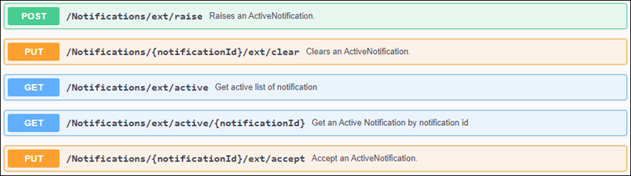

# Notifier OpenAPI implementation

This guide shows how to use the Notifier OpenAPI in different ways. Here the OpenAPI is implemented within an user-developed app to send notifications to the Notifier. Furthermore it is shown how to use the OpenAPI within the Flow Creator and with Postman.

- [Notifier OpenAPI implementation](#notifier-openapi-implementation)
  - [Description](#description)
    - [Notifier OpenAPI](#notifier-openapi)
    - [General task](#general-task)
  - [Requirements](#requirements)
    - [Used components](#used-components)
    - [Further requirements](#further-requirements)
    - [TIA Project](#tia-project)
  - [Using Notifier OpenAPI within a custom app](#using-notifier-openapi-within-a-custom-app)
  - [Using Notifier OpenAPI within the Flow Creator](#using-notifier-openapi-within-the-flow-creator)
  - [Using Notifier OpenAPI with Postman](#using-notifier-openapi-with-postman)
  - [Documentation](#documentation)
  - [Contribution](#contribution)
  - [Licence and Legal Information](#licence-and-legal-information)

## Description

### Notifier OpenAPI

The Notifier OpenAPI definition contains the following HTTP requests:

V1.1:

V1.0 (deprecated)

The current Notifier OpenAPI specification can be downloaded [here](docs/Notifier%20OpenAPI.zip).

Using these HTTP requests, notifications can be for example triggered from another app and displayed in the Notifier.

### General task

This how to shows two ways of using the Notifier OpenAPI.

First it is described how to implement a JavaScript app in Docker including the Notifier OpenAPI. The app calculates and monitors a KPI value. Therefore the user can define two input tags that are coming from S7 Connector, as well as a min and max limit of the KPI value. In case these limits are passed, the app sends a notification to the Notifier app on the IED.

Furthermore it is shown how to handle the Notifier OpenAPI requests within the Flow Creator. Here the user can for example list the sended notifications from the custom app, accept and clear them.

Additionally it is shown how to handle the Notifier OpenAPI requests with Postman, a free API platform.

## Requirements

### Used components

- Industrial Edge Management (IEM) V1.3.0-58 / V1.4.3
  - IE App Configuration Service V1.0.7
  - IE Databus Configurator V1.4.22
  - IE Databus V1.4.16
  - S7 Connector Configurator V1.4.9
  - S7 Connector V1.4.10
- Industrial Edge Device (IED) V1.3.0-57
  - Notifier V1.3.0-11296596
  - IE Flow Creator V1.2.2
- Industrial Edge App Publisher V1.4.3
- Docker Engine V20.10.10
- Docker Compose V1.28.5
- TIA Portal V16
- PlcSim Advanced for CPU 1518 ODK

### Further requirements

- Access to an IEM with onboarded IED
- Installed system configurators and apps (see list "Used components")
- Installed apps (see list "Used components")
- IED is connected to PLC
- TIA portal project loaded on PLC
- Google Chrome (Version ≥ 72) or Firefox (Version ≥ 62)

### TIA Project

The used TIA Portal project can be found in the [miscellaneous repository](https://github.com/industrial-edge/miscellaneous) in the tank application folder and is also used for several further application examples:

- [Tia Tank Application](https://github.com/industrial-edge/miscellaneous/tree/main/tank%20application)

## Using Notifier OpenAPI within a custom app

You can find further information about the following steps [here](docs/Installation.md).

- [Build application](docs/Installation.md#build-application)
- [Upload  App to the Industrial Edge Managment](docs/Installation.md#upload--app-to-the-industrial-edge-managment)
- [Deploying of App](docs/Installation.md#deploying-of-app)
- [Configure PLC project](docs/Installation.md#configure-plc-project)
- [Configure PLC Connection](docs/Installation.md#configure-plc-connection)
- [Test the application](docs/Installation.md#test-the-application)

## Using Notifier OpenAPI within the Flow Creator

You can find further information about the following steps [here](docs/FlowCreator.md).

- [Launch the Flow Creator](docs/FlowCreator.md#launch-the-flow-creator)
- [List all notifications](docs/FlowCreator.md#list-all-notifications)
- [List one notification](docs/FlowCreator.md#list-one-notification)
- [Accept one notification](docs/FlowCreator.md#accept-one-notification)
- [Clear one notification](docs/FlowCreator.md#clear-one-notification)
- [Raise one notification](docs/FlowCreator.md#raise-one-notification)

## Using Notifier OpenAPI with Postman

The Notifier OpenAPI requests can also be tested and used via the API platform Postman.
You can find further information about the following steps [here](docs/Postman.md).

- [List all notifications](docs/Postman.md#list-all-notifications)
- [List one notification](docs/Postman.md#list-one-notification)
- [Accept one notification](docs/Postman.md#accept-one-notification)
- [Clear one notification](docs/Postman.md#clear-one-notification)
- [Raise one notification](docs/Postman.md#raise-one-notification)

## Documentation

You can find further documentation and help in the following links.

- [Industrial Edge Hub](https://iehub.eu1.edge.siemens.cloud/#/documentation)
- [Industrial Edge Forum](https://www.siemens.com/industrial-edge-forum)
- [Industrial Edge landing page](https://new.siemens.com/global/en/products/automation/topic-areas/industrial-edge/simatic-edge.html)
- [Industrial Edge GitHub page](https://github.com/industrial-edge)
  
## Contribution

Thank you for your interest in contributing. Anybody is free to report bugs, unclear documentation, and other problems regarding this repository in the Issues section. Everybody is free to propose any changes to this repository using Pull Requests.

## Licence and Legal Information

Please read the [Legal information](LICENSE.md).
