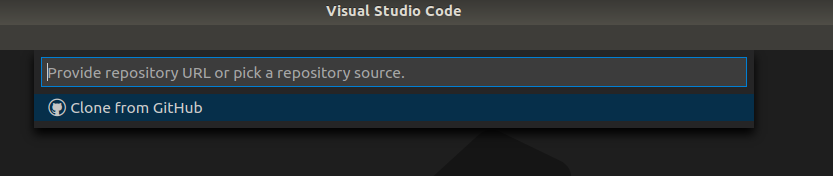

# Implement Notifier OpenAPI within a custom app

- [Implement Notifier OpenAPI within a custom app](#implement-notifier-openapi-within-a-custom-app)
  - [Build application](#build-application)
    - [Download Repository](#download-repository)
    - [Build docker image](#build-docker-image)
  - [Upload application to the Industrial Edge Managment](#upload-application-to-the-industrial-edge-managment)
  - [Create configuration for the application](#create-configuration-for-the-application)
    - [Configuration via fixed config file](#configuration-via-fixed-config-file)
    - [Configuration via app Configuration Service](#configuration-via-app-configuration-service)
  - [Install the application](#install-the-application)
  - [Configure PLC project](#configure-plc-project)
  - [Configure PLC connection](#configure-plc-connection)
  - [Test the application](#test-the-application)

This app calculates and monitors a KPI value, which input data is coming from the S7 Connector into the Databus. The app connects to the Databus via MQTT and and subscribes to the S7 Connector topic. The defined tags containing the KPI data are queried and the KPI value is calculated frequently. In case the defined min and max limits are passed, a notification message is send to the Notifier app on the IED. To use the app, the user must define a user and password for the Databus, the Data Service asset that is used, two input tags that are coming from S7 Connector, as well as a min and max limit of the KPI value.


The app is implemented with **JavaScript** in Docker, using the **XMLHttpRequest** API to transfer data via HTTP.
Here the notification source name was set to "*KPI calculation app*", which can be later used within other API calls.

```javascript
var XMLHttpRequest = require("xmlhttprequest").XMLHttpRequest;
const request = new XMLHttpRequest();
...
const urlRaise = 'http://notifier:4201/notificationservice/notifications/ext/raise';
postMin = JSON.stringify({
  'notificationTypeId': '2',
  'eventText': 'KPI value under defined limit of ' + LIMIT_MIN,
  'assetId': ASSET,
  'notificationSource': 'KPI calculation app'
});
...
request.open('POST', urlRaise);
request.setRequestHeader("Content-Type", "application/json;charset=UTF-8");
request.send(postMin);
```

## Build application

### Download Repository

Download or clone the repository source code to your workstation.  


* Trough terminal:
```bash
git clone https://github.com/industrial-edge/notifier-api.git
```

* Trough VSCode:  
<kbd>CTRL</kbd>+<kbd>&uarr; SHIFT</kbd>+<kbd>P</kbd> or <kbd>F1</kbd> to open VSCode's command pallette and type `git clone`:



### Build docker image

- Navigate into `src` and find the file named `Dockerfile.example`. The `Dockerfile.example` is an example Dockerfile that can be used to build the Docker images of the backend and the frontend. If you choose to use these, rename them both to `Dockerfile` before proceeding
- Open a console in the root folder (where the `docker-compose` file is)
- Use the `docker compose build` (replaces the older `docker-compose build`) command to build the docker image of the service which is specified in the docker-compose.yml file.
- These Docker images can now be used to build your app with the Industrial Edge App Publisher
- `docker images` can be used to check for the images

## Upload application to the Industrial Edge Managment

Please find below a short description how to publish your application in your IEM.

- Connect your Industrial Edge App Publisher to your docker engine
- Connect your Industrial Edge App Publisher to your Industrial Edge Managment System
- Create a new application
- Add a new version for the application
- Import the [docker-compose](/docker-compose.yml) file using the **Import YAML** button
- Review, validate and create the version
- The warning `Build (sevices >> scanner-service) is not supported` can be ignored


- **Start Upload** to transfer the app to Industrial Edge Managment


For more detailed information please see the section for [uploading apps to the IEM](https://github.com/industrial-edge/upload-app-to-iem).

## Create configuration for the application

For this KPI calculation and notification app, several parameters need to be configured in advance:

- "MQTT_USER": username of the databus user
- "MQTT_PASSWORD": password of the databus user
- "TAG_FAULTY": S7 connector tag for faulty value (e.g. "faulty" for S7 or "GDB.process.numberFaulty" for OpcUa)
- "TAG_PRODUCED": S7 connector tag for produced value  (e.g. "produced" for S7 or "GDB.process.numberProduced" for OpcUa)
- "LIMIT_MIN": minimum limit value for the KPI value
- "LIMIT_MAX": maximum limit value for the KPI value
- "ASSET": data service asset, that is necessary for the notifications

The configuration file has to be named **mqtt-config.json**.

This repository provides two files for different ways of configuration:

- Configuration via fixed config file
- Configuration via app Configuration Service (flexible with UI)

### Configuration via fixed config file

Here a fixed configuration file is used for configuration, that cannot be modified during the installation of the application. It has to be structured like this:

```json
{
    "MQTT_USER":"edge",
    "MQTT_PASSWORD":"edge",
    "TAG_FAULTY":"GDB.process.numberFaulty",
    "TAG_PRODUCED":"GDB.process.numberFaulty",
    "LIMIT_MIN":"70",
    "LIMIT_MAX":"90",
    "ASSET":"549c3daa33cd4628b02c2e2745f54d80"
}
```

In this example, the application will authenticate to the databus with the username "edge" and password "edge". It will subscribe to the tags "GDB.process.numberFaulty" and "GDB.process.numberFaulty". The limits are set to 70 and 90. The asset id is "549c3daa33cd4628b02c2e2745f54d80", which belongs to the asset "edge/tank application" in the Data Service.

The corresponding configuration file can be found [here](/cfg-data/mqtt-config.json).

To add a configuration using this file, follow these steps:

- Open the Industrial Edge Management web interface
- Go to "Applications" > "My Projects"
- Open the KPI calculation and notification application
- Click on "Configurations" > "Add Configuration"
- Enter a name and description
- Enter `./cfg-data` as host path
- Enter a template name and description
- Browse for the `mqtt-config.json` file
- Click "Add"


### Configuration via app Configuration Service

Here the system app IE Configuration Service is used to create an UI for the configuration of the application. The UI is based on a JSON Forms file, that is integrated as a configuration template via the Publisher. By using this configuration during the installation, the user can fill out the parameter individual.

First the system app IE Configuration Service must be installed on the IEM. Then a JSON Forms file must be created, consisting of an UI schema and a data schema. Please see this [getting started](https://jsonforms.io/docs/getting-started) to learn more about JSON Forms.

A predefined configuration file can be found [here](/cfg-data/json_schema/mqtt-config.json).

To add a configuration using this file, follow these steps:

- Open the Industrial Edge App Publisher
- Open the KPI calculation and notification application
- Click on "Configurations" > "Add Configuration"
- Enter a name and description
- Enter `./cfg-data` as host path
- Enter a template name and description
- Browse for the `mqtt-config.json` file
- Activate "Json Schema"
- Click "Add"


## Install the application

The application now provides several ways of configuration, that can be selected during installation. To install the application on an Industrial Edge Device, follow these steps:

- Open the Industrial Edge Management web interface
- Go to "Applications" > "My Projects"
- Open the KPI calculation and notification application
- Click on the install button on the right of the version you want to deploy
- Under "Schema Configurations" select the above created UI configuration and fill the parameter

OR

- Under "Other Configurations" select the above created configuration for fixed file


- Select the corresponing Industrial Edge Device
- Click "Install Now" and wait for the job to be finished successfully

## Configure PLC project

- Open TIA portal and open the project containing the tank filling application
- Download the PLC program to the PLC and set the PLC into RUN
- Open the HMI to start the tank filling application

## Configure PLC connection

To read data from the PLC and provide the data, use the S7 Connector to establish a connection to the PLC (e.g. via OPC UA or S7). Create two tags for faulty and produced value.


The S7 Connector sends the data to the Databus, from where the app collects the data for the KPI calculation. Therefore you need to create a suitable Databus topic.


## Test the application

- Go to your Edge device and start the KPI calculation and notification app
- Make sure the tank filling application is running and number of produced bottles is increasing
- Simulate some faulty bottles in the tank filling application by clicking "next bottle" in the corresponding HMI
- The app uses the following formula to calculate the KPI value: `quality [%] = 100 - ( <faulty> / <produced> * 100 )`
- As soon as one of the defined limits (min/max) is passed, the app sends a notification to the Notifier
- You can watch the incoming notifications on the Notifier UI

Example for min limit:
- Simulate 7 faulty bottles
- Wait for 20 bottles to be produced
- KPI = 100 - (7 / 20 * 100) = 65
- KPI is below limit of 70

=> notification is send


Example for max limit:
- Simulate 1 faulty bottles
- Wait for 20 bottles to be produced
- KPI = 100 - (1 / 20 * 100) = 95
- KPI is above limit of 90

=> notification is send


> Hint: The application only sends **one** notification when a limit is reached (like a flank). Afterwards the KPI must go back into rated range or hit the opposite limit to send another notification.
